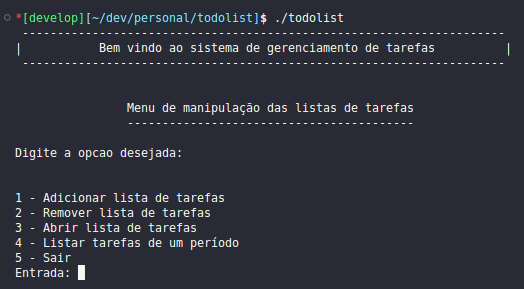

<h1 align="center"> Todolist </h1>

<p align="center">
  

  
  
  <a href="https://github.com/LucasPereiraMiranda/todolist/commits/main">
    
  </a>

  <a href="https://github.com/LucasPereiraMiranda/todolist/issues">
    
  </a>

  <a href="https://github.com/LucasPereiraMiranda/todolist/issues">
    
  </a>
</p>

## 💻 Objectives

An academic program designed to create and manage task lists, specifically developed for Linux distributions. The interface is in PT-BR (Brazilian Portuguese).

### Execution preview:

<div align="center">
  
</div>

## 🚀 Techs

The program is being performed with the following technologies:

- [C](https://www.cprogramming.com/)
- [make](https://www.gnu.org/software/make/manual/make.html)

## :boom: How to run the application?

- With gcc already installed, we can run in the root:

```shell
  make

```

- After this, we can run compiled file:

```shell
  ./todolist
```

### License

[MIT](https://choosealicense.com/licenses/mit/)
